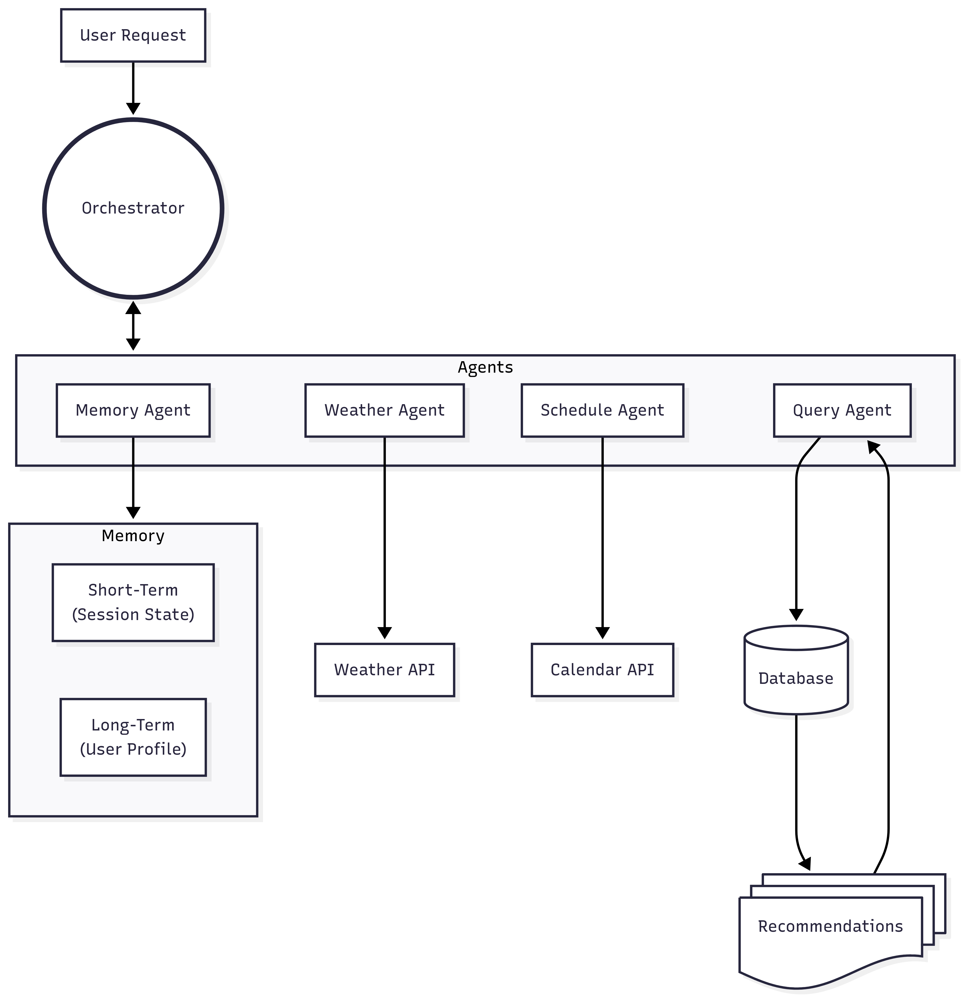

# Adventure Advisor

[Launch app here!](https://adventure-advisor.streamlit.app/?embed=true)

> Personalized, AI-based outdoor activity recommender system for activities such as hiking, running, cycling, via ferrata, climbing, mountaineering.

[Project description & requirements](https://docs.google.com/document/d/1fnTi8bGLr4bmyiPhwUcyi8KCYAVgEAzMyFstvKaeqNs/edit?usp=sharing)

# Architecture


# Agents
Our current setup uses Google's Gemini models: [Gemini API tutorial](https://colab.research.google.com/github/google-gemini/cookbook/blob/main/quickstarts/Get_started.ipynb)

# Database
The database is realized with Supabase.

To get server-side shuffling on the results, the following view has been created for the DB:

```
create or replace view random_hiking_routes as
select * from hiking_routes
order by random();
```

# Deployment
Run locally as `streamlit run code/main.py`.

## Environment vars
Set up local environment with credentials, API keys, etc in `code/.env`:

```
GOOGLE_OAUTH_CREDENTIALS={"client_id":"xxx.apps.googleusercontent.com","project_id":"xxx","auth_uri":"https://accounts.google.com/o/oauth2/auth","token_uri":"https://oauth2.googleapis.com/token","auth_provider_x509_cert_url":"https://www.googleapis.com/oauth2/v1/certs","client_secret":"xxx","redirect_uris":["http://localhost"]}

GEMINI_API_KEY=xxx
SUPABASE_URL=xxx
SUPABASE_KEY=xxx
```

- [Create own Gemini API key](https://aistudio.google.com/app/apikey), add as `GEMINI_API_KEY`
- Calendar integration vie Google Calendar: account needs to be added manually (contact us).

**NB**: don't commit API keys to repo


## Requirements
Create conda environment file: `conda env export --from-history | grep -v "^prefix: " > environment.yml`. Update if new dependencies are added.

- google-api-python-client
- google-ai-generativelanguage
- google-auth
- google-auth-oauthlib
- google-genai
- langchain
- langchain-community
- langchain-core
- langchain-experimental
- langchain-google-genai
- oauthlib
- osmnx
- psycopg2
- pydantic
- python-weather
- pytz
- streamlit
- streamlit-folium
- supabase
